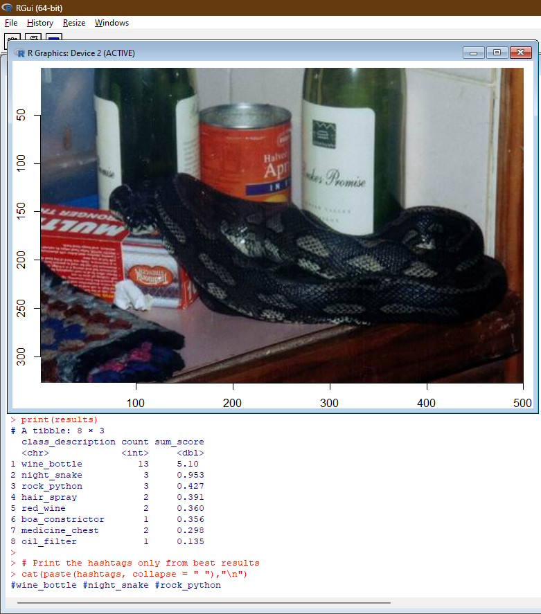
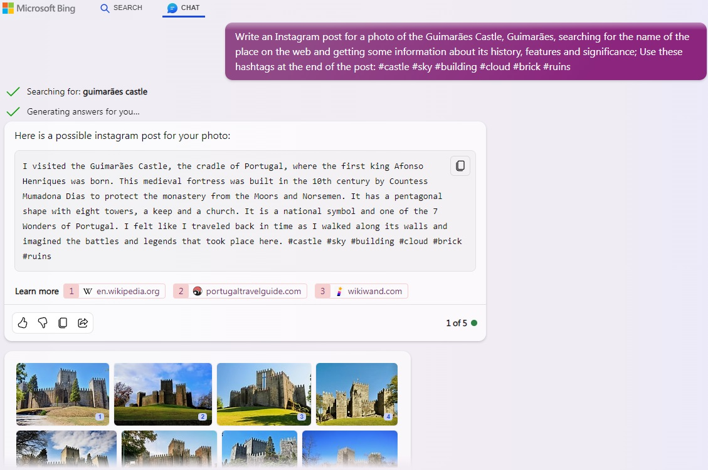

# ImageAI-R
R scripts developed to load an image (local or internet) and identify people/pets/objects based on AI Image Recognition CNN (<a href="https://en.wikipedia.org/wiki/Convolutional_neural_network">Convolutional Neural Network</a>) models, mostly trained on the <a href="https://en.wikipedia.org/wiki/ImageNet">ImageNet</a> classification database, providing a total of 1000 possible tags that could be identified within each image. Additionally, the scripts try to identify the landmark/location based on <a href="https://cloud.google.com/vision/">Google Cloud Vision AI</a>, <a href="https://azure.microsoft.com/en-us/products/ai-services/ai-vision">Azure Vision AI</a>, <a href="https://developers.google.com/maps/documentation/places/web-service/overview">Google Places API</a> and <a href="https://www.microsoft.com/en-us/maps/bing-maps/location-recognition">Bing Location Recognition API</a> to, finally, use all the location and image information gathered to automatically generate a prompt to <a href="https://www.bing.com/chat">Bing Chat</a> for automated AI text-generation of a social media posting.

There are 4 types of scripts:
- A **simple** one that uses only a single AI model for image recognition ([1-AI_image_tag_simple.R](1-AI_image_tag_simple.R));
  
- A second more **complex** that does tag identification using 15 models at the same time, based on the knowledge that, depending on what is contained in the image, some models work better than others. This script aims to get the classification tags from those more prevalent and with higher prediction confidence accross all models ([2-AI_image_tag_multimodal.R](2-AI_image_tag_multimodal.R));

- The third script still uses all 15 models above, but is also using **Google and Azure Vision AI** (API keys required) to further improve tags and to identify landmarks and addresses ([3-AI_image_multimodal_location.R](3-AI_image_multimodal_location.R));

- Based on all the above knowledge about the image, the forth script improves the results further by also using **Google Maps API and Bing Maps API** (API keys required) to more accurately search for the location/landmark name based on GPS data and hashtags found on image. Finally, it generates a **prompt for Bing Chat** on the default browser requesting a social media text for easier posting, feeding the AI with probable location and hashtags identified ([4-AI_image_multimodal_location_GPT.R](4-AI_image_multimodal_location_GPT.R)).

# Image recognition models being used:
- MobileNetV3
- VGG16
- VGG19
- ResNet-50
- ResNet-101
- ResNet-152
- ResNet50V2
- ResNet101V2
- ResNet152V2
- DenseNet201
- Xception
- Inception-ResNet-v2
- Inception-V3
- NasNetLarge
- EfficientNet B7
- Azure Vision AI
- Google Cloud Vision
